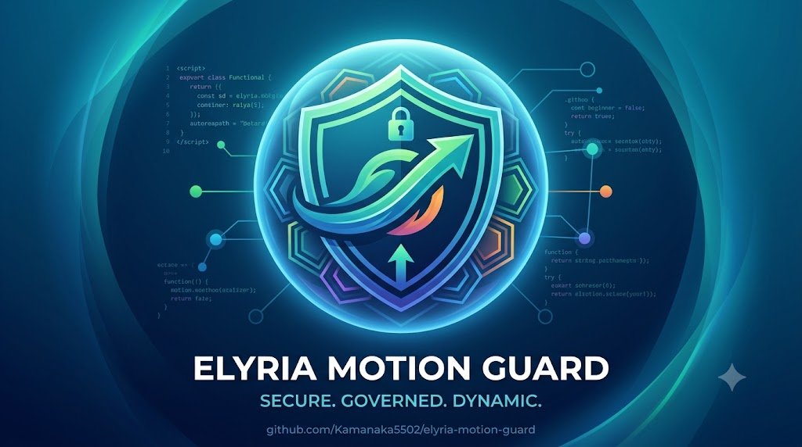

<p align="center">
  
</p>

<p align="center">
  
  
  
  
</p>

# Elyria Motion Guard

Old-stack compatible pre-execution motion-admission wrapper for AI-assisted financial intent, invariant routing, non-binding review, replayable receipts, and fail-closed consequence control.

<p align="center">
  
</p>

```text
AI-assisted financial intent is not executable money movement.
```

Elyria Motion Guard is the small sellable wrapper around the larger Elyria/Veritas motion-governance substrate.

It is designed for finance teams, accounts payable workflows, fractional CFOs, payment operators, and AI automation agencies that need a simple control before payment intent becomes value-bearing motion.

## Start Here

<p align="center">
  
  
</p>

```text
Financial instruction exists
  !=
Financial motion may bind
```

Motion Guard asks:

<p align="center">
  
</p>

```text
May this AI-assisted financial intent become value-bearing motion?
```

## Old-Stack Compatible Interface

<p align="center">
  
  
  
  
</p>

Motion Guard exposes a simple interface:

```text
JSON payment-intent packet in
  -> invariant checks
  -> gate decision
  -> chute outcome
  -> replayable receipt out
```

It can be used from CLI, scripts, AP workflows, or later CSV / web-form adapters.

## New-Stack Governance Core

<p align="center">
  
  
  
  
</p>

The external interface is old-stack compatible.

The internal order remains kernel-governed:

```text
kernel governance
  -> invariant resolution
  -> logic word
  -> gate
  -> chute
  -> receipt
  -> replay
```

## Invariants

<p align="center">
  
  
  
  
  
  
</p>

```text
AUTHORITY
EVIDENCE
BENEFICIARY
CUSTODY
SETTLEMENT
REVERSIBILITY
```

## Outcomes

<p align="center">
  
  
  
  
  
  
</p>

```text
ADMIT
REFUSE
REPAIR
QUARANTINE
ESCALATE
FAIL_CLOSED
```

Review, repair, and escalation are non-binding. No payment motion is admitted while review, repair, or escalation remains unresolved.

## Run

<p align="center">
  
  
</p>

```bash
python motion_guard.py examples/clean_payment.json
python motion_guard.py examples/stale_approval.json
python motion_guard.py examples/beneficiary_mismatch.json
python motion_guard.py examples/missing_evidence.json
python motion_guard.py examples/irreversible_transfer.json
```

Run the public proof harness:

```bash
python run_proof.py
```

Expected result:

```text
all_passed: true
```

## Boundary

<p align="center">
  
  
  
</p>

This wrapper does not execute payments, connect to payment rails, replace accounting systems, replace legal/compliance review, or expose the protected Elyria/Veritas substrate.

It evaluates motion admission before value-bearing consequence binds.

## Product Line

<p align="center">
  
  
  
</p>

```text
Elyria Motion Guard
  -> small wrapper / first commercial corridor

Elyria Financial Motion Governance
  -> public proof-surface / enterprise substrate framing

Elyria / Veritas substrate
  -> protected commercial runtime
```
